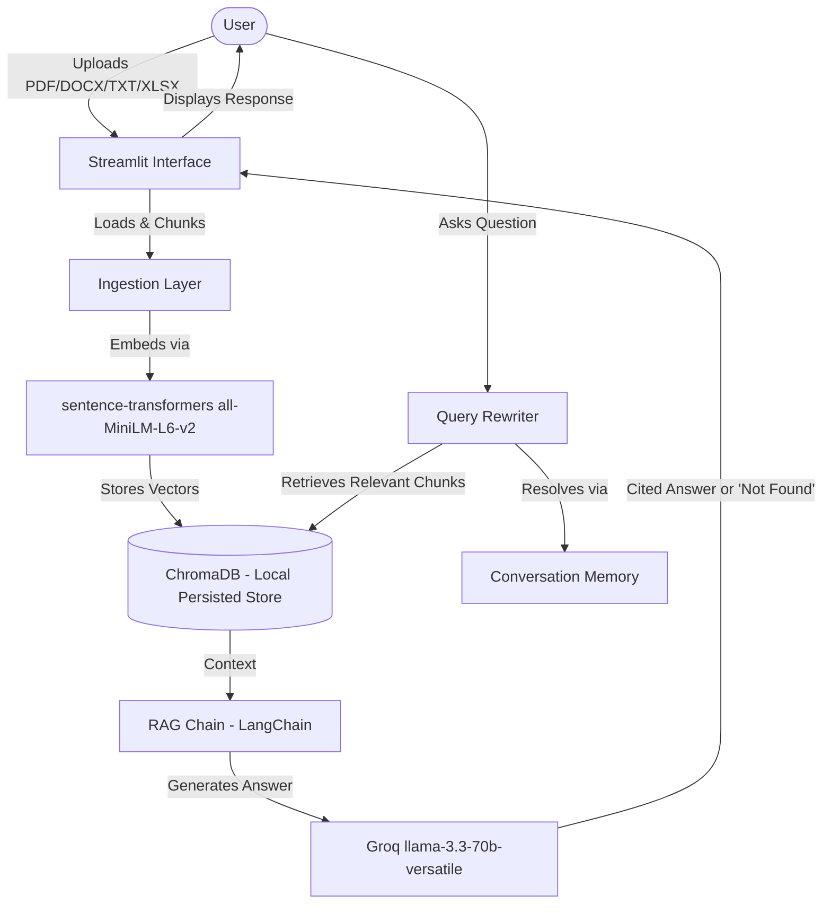
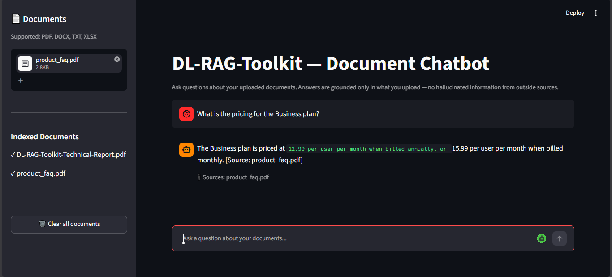
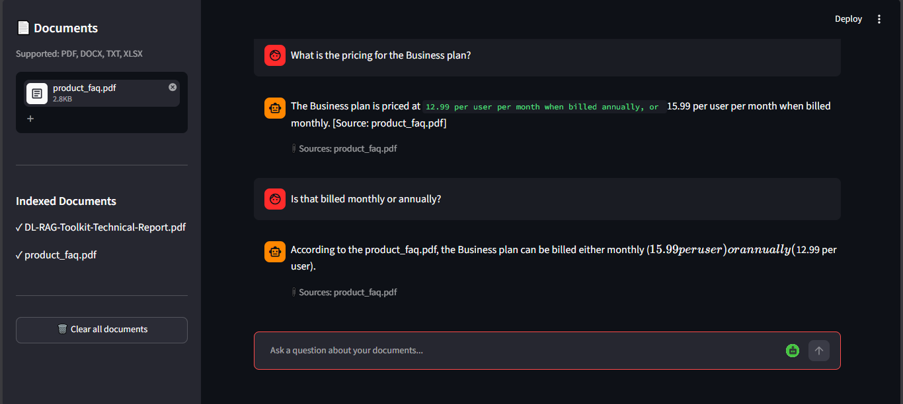
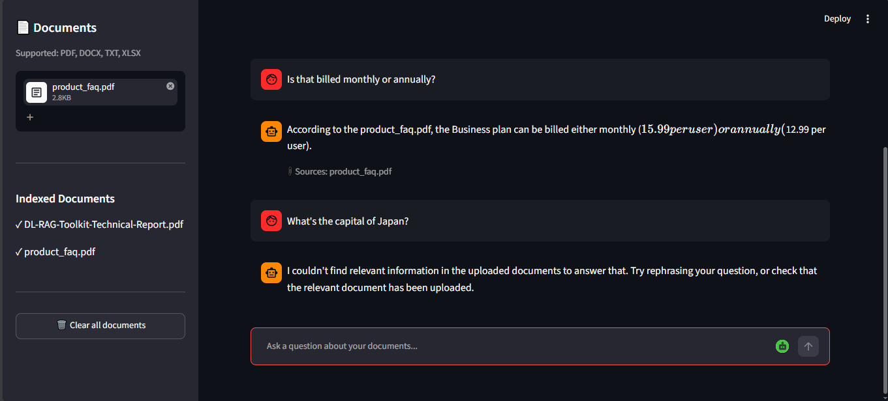

# 🚀 DL-RAG-Toolkit - Deep Learning Fundamentals & Applied RAG

DL-RAG-Toolkit is a two-tier **AI Engineering deliverable** combining five trained **deep learning model architectures** (ANN, CNN, RNN, LSTM, Transfer Learning) with an applied **Retrieval-Augmented Generation chatbot**. The RAG system answers questions grounded strictly in user-uploaded documents (PDF, DOCX, TXT, XLSX), with zero hallucination on out-of-scope queries. Built as an AI Engineering internship deliverable for **Alphatron Technologies™**, in collaboration with **MMSE Lab, NED University**.

**Full technical report:** [`DL-RAG-Toolkit-Technical-Report.pdf`](./DL-RAG-Toolkit-Technical-Report.pdf) — architecture reasoning, every dataset choice, real bugs encountered and fixed, and honest results for every model.

---

## 🏗️ System Architecture & Workflow

The toolkit has two independent tiers with no shared roles, database, or auth layer — architecture is scoped separately for each.

### Intermediate Level — 5 trained deep learning models

Five standalone model pipelines, each following the same shape: load data → train → evaluate → save results and checkpoint to `results_artifacts/`. No inter-model dependencies.

| Model | Task | Test Accuracy | Notable finding |
| :--- | :--- | :--- | :--- |
| **ANN** | Breast Cancer classification | 97.67% | Clean convergence, no overfitting |
| **CNN** | FashionMNIST classification | 87.70% | Shirt/Pullover/Coat confusion — known hard case |
| **RNN** | 20 Newsgroups classification | 27.19% | Barely beat random guessing — textbook vanishing gradients |
| **LSTM** | Same task, identical hyperparameters | 54.92% | ~2x the RNN — same data, only the architecture changed |
| **Transfer Learning** | CIFAR-10 via pretrained ResNet18 | 84.10% | Fast convergence, overfitting from limited data |

The RNN and LSTM were deliberately trained on **identical data and hyperparameters** — the point isn't tuning either model to its best result, it's proving *why* LSTMs replaced vanilla RNNs for sequence tasks. Full breakdown in the technical report.

### Advanced Level — RAG Document Chatbot (Workflow)

Upload a document, ask questions grounded only in that document — no outside-knowledge answers.



**Key guarantees:**
- Never answers from outside knowledge — if nothing relevant is retrieved, it says so instead of guessing
- Multi-turn follow-up questions ("How tall is it?") resolve correctly via query rewriting against conversation history
- Every answer cites its source document

*Note: no ERD is included — the toolkit has no database. ChromaDB is used as a local, persisted vector store, not a relational schema.*

Additional diagrams (architecture, full request lifecycle, and application state transitions) are maintained separately:
- [Architecture Diagram](./docs/diagrams/architecture.md)
- [Flow Diagram](./docs/diagrams/flow_diagram.md)
- [State Diagram](./docs/diagrams/state_diagram.md)

---

### Demo

**Grounded, cited answer:**


**Follow-up question resolved via query rewriting:**


**Anti-hallucination fallback on out-of-scope questions:**


---

## 🛠️ Technology Stack

### Deep Learning (Intermediate Level)
- **Frameworks:** PyTorch-based model implementations (ANN, CNN, RNN, LSTM, Transfer Learning)
- **Transfer Learning Base:** Pretrained ResNet18
- **Shared Utilities:** Common metrics and plotting utilities across all five models

### RAG Chatbot (Advanced Level)
- **Orchestration:** LangChain
- **Vector Store:** ChromaDB (local, persisted)
- **Embeddings:** sentence-transformers (`all-MiniLM-L6-v2`)
- **Generation:** Groq (`llama-3.3-70b-versatile`)
- **Interface:** Streamlit
- **Testing:** pytest

---

## 📂 Project Directory Structure

```
DL-RAG-toolkit/
├── intermediate/           # 5 DL model implementations
│   ├── common/              # shared metrics + plotting utilities
│   ├── ann/  cnn/  rnn/  lstm/  transfer_learning/
│   └── each contains: model.py, train.py, results.md, results_artifacts/
│
├── advanced/                # RAG chatbot
│   ├── app/streamlit_app.py    # entry point
│   ├── ingestion/               # PDF/DOCX/TXT/XLSX loaders + chunking
│   ├── embeddings/              # embedding model wrapper
│   ├── retrieval/               # ChromaDB integration
│   ├── memory/                  # conversation memory
│   ├── chain/                   # RAG orchestration + Groq integration
│   ├── config.py
│   └── tests/                   # pytest suite
│
├── docs/diagrams/            # architecture, flow, and state diagrams (Mermaid)
├── data/                     # sample datasets + test documents
├── DL-RAG-Toolkit-Technical-Report.pdf
└── requirements.txt
```

---

## 🚀 Installation & Local Setup

### Prerequisites
- **Python** 3.11+
- A [Groq API key](https://console.groq.com) (free tier available)

### Step 1: Clone the Repository
```bash
git clone https://github.com/SameerAhmedAI/DL-RAG-toolkit.git
cd DL-RAG-toolkit
```

### Step 2: Create and Activate a Virtual Environment

**Windows (PowerShell):**
```bash
python -m venv .venv
.venv\Scripts\activate
```

**macOS/Linux:**
```bash
python -m venv .venv
source .venv/bin/activate
```

### Step 3: Install Dependencies
```bash
pip install -r requirements.txt
```

### Step 4: Configure Environment
Create a `.env` file at the repo root:
```env
GROQ_API_KEY=your_groq_api_key_here
```

### Step 5: Run the Intermediate Level Models
```bash
python -m intermediate.ann.train
python -m intermediate.cnn.train
python -m intermediate.rnn.train
python -m intermediate.lstm.train
python -m intermediate.transfer_learning.train
```
Each script trains, evaluates, and saves results (plots + checkpoint) to that model's `results_artifacts/` folder.

### Step 6: Run the RAG Chatbot
```bash
streamlit run advanced/app/streamlit_app.py
```
Opens in your browser. Upload a document, then ask questions grounded in its content.

### Step 7: Run Tests
```bash
pytest advanced/tests/test_ingestion.py -v
```

---
