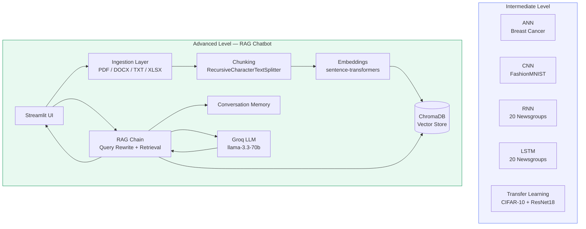

# Architecture Diagram — DL-RAG-Toolkit

```mermaid
graph TB
    subgraph Intermediate["Intermediate Level"]
        ANN[ANN<br/>Breast Cancer]
        CNN[CNN<br/>FashionMNIST]
        RNN[RNN<br/>20 Newsgroups]
        LSTM[LSTM<br/>20 Newsgroups]
        TL[Transfer Learning<br/>CIFAR-10 + ResNet18]
    end

    subgraph Advanced["Advanced Level — RAG Chatbot"]
        UI[Streamlit UI]
        ING[Ingestion Layer<br/>PDF / DOCX / TXT / XLSX]
        CHUNK[Chunking<br/>RecursiveCharacterTextSplitter]
        EMB[Embeddings<br/>sentence-transformers]
        DB[(ChromaDB<br/>Vector Store)]
        CHAIN[RAG Chain<br/>Query Rewrite + Retrieval]
        MEM[Conversation Memory]
        LLM[Groq LLM<br/>llama-3.3-70b]
    end

    UI --> ING --> CHUNK --> EMB --> DB
    UI --> CHAIN
    CHAIN --> DB
    CHAIN --> MEM
    CHAIN --> LLM
    LLM --> CHAIN --> UI

    style Intermediate fill:#f0f2ff,stroke:#4f6df5
    style Advanced fill:#e8f9f0,stroke:#0d9155
```