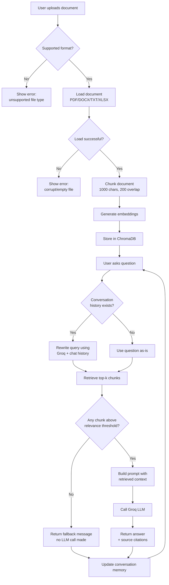

```mermaid
flowchart TD
    A[User uploads document] --> B{Supported format?}
    B -->|No| C[Show error:<br/>unsupported file type]
    B -->|Yes| D[Load document<br/>PDF/DOCX/TXT/XLSX]
    D --> E{Load successful?}
    E -->|No| F[Show error:<br/>corrupt/empty file]
    E -->|Yes| G[Chunk document<br/>1000 chars, 200 overlap]
    G --> H[Generate embeddings]
    H --> I[Store in ChromaDB]
    I --> J[User asks question]
    J --> K{Conversation<br/>history exists?}
    K -->|Yes| L[Rewrite query using<br/>Groq + chat history]
    K -->|No| M[Use question as-is]
    L --> N[Retrieve top-k chunks]
    M --> N
    N --> O{Any chunk above<br/>relevance threshold?}
    O -->|No| P[Return fallback message<br/>no LLM call made]
    O -->|Yes| Q[Build prompt with<br/>retrieved context]
    Q --> R[Call Groq LLM]
    R --> S[Return answer<br/>+ source citations]
    P --> T[Update conversation memory]
    S --> T
    T --> J
```