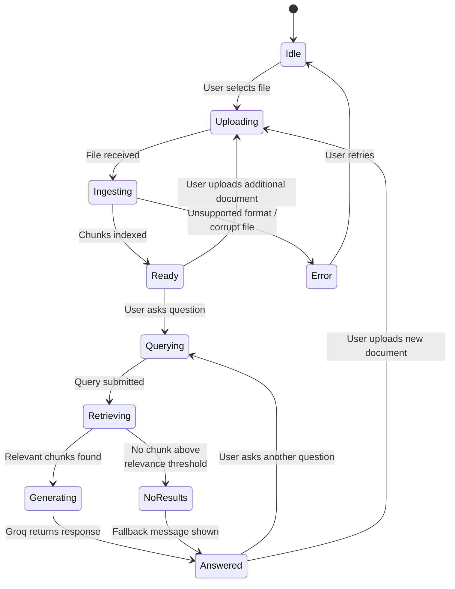

```mermaid
stateDiagram-v2
    [*] --> Idle

    Idle --> Uploading: User selects file
    Uploading --> Ingesting: File received
    Ingesting --> Ready: Chunks indexed
    Ingesting --> Error: Unsupported format /<br/>corrupt file
    Error --> Idle: User retries

    Ready --> Querying: User asks question
    Querying --> Retrieving: Query submitted
    Retrieving --> NoResults: No chunk above<br/>relevance threshold
    Retrieving --> Generating: Relevant chunks found
    Generating --> Answered: Groq returns response
    NoResults --> Answered: Fallback message shown

    Answered --> Querying: User asks another question
    Answered --> Uploading: User uploads new document
    Ready --> Uploading: User uploads additional document
```